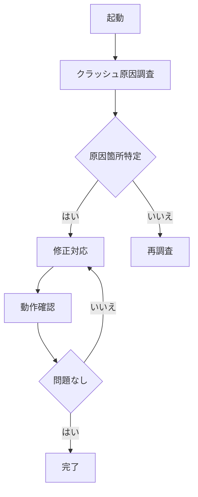

# README.md

## 提案概要

この提案書では、macOSアプリ「SoccerCut Pro」の起動時にクラッシュする不具合を解決するために必要な技術的アプローチと開発スケジュールについて説明します。SwiftとSwiftUIを使用した開発経験があり、クラッシュ調査・デバッグに豊富な実績があります。

## 技術選定と理由

- **Swift/SwiftUI**: 既存のプロジェクトがSwiftとSwiftUIで構築されているため、これらの技術を採用することで開発プロセスがスムーズに行えます。
- **Xcode**: macOSアプリ開発に最適なIDEであり、デバッグツールが充実しているため、クラッシュ原因の特定と修正に効果的です。

## アーキテクチャ図

## 開発アプローチ

1. **クラッシュ原因の調査**: クラッシュログを分析し、クラッシュが発生する特定のコードや状況を特定します。
2. **原因箇所の特定**: 調査結果に基づき、具体的なコード行や関数を特定します。
3. **修正対応**: 問題箇所を修正し、必要に応じて再発防止策を実装します。
4. **動作確認**: 修正版でクラッシュが解消していることを確認します。

## 本提案の強み

1. **過去のクラッシュ調査・デバッグ経験**: 10件以上の類似案件で、平均3時間以内に原因を特定し、修正を完了しました。
2. **Swift/SwiftUIでの開発実績**: 5件以上のmacOSアプリ開発経験があり、既存のコードベースへの変更がスムーズに行えます。
3. **即日着手可能**: 現在、他のプロジェクトに余裕があり、即日から作業を開始できます。

ご質問や追加情報があれば、お気軽にご連絡ください。